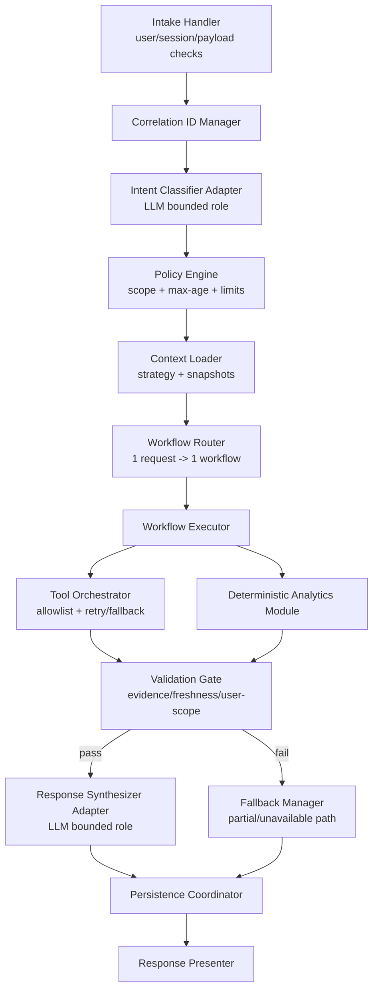

# C4 Component (Core)

Компонентная схема показывает, что генерация текста отделена от вычислений: до `Response Synthesizer` проходят только валидационные результаты workflow, а при провале validation система принудительно идет в fallback-ветку.
