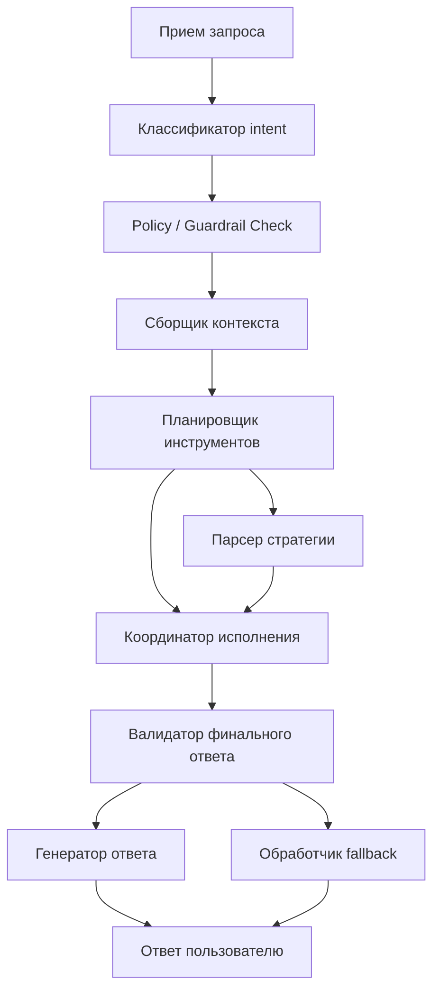

# C4 Component Diagram

Ядро системы организовано как последовательность явных контрольных ворот. Каждый запрос проходит через классификацию, policy checks, сбор контекста, контролируемое исполнение и synthesis, проверяемый валидатором финального ответа. Если данные неполные или итоговый текст невалиден, система уходит в fallback вместо того, чтобы позволить LLM импровизировать.
