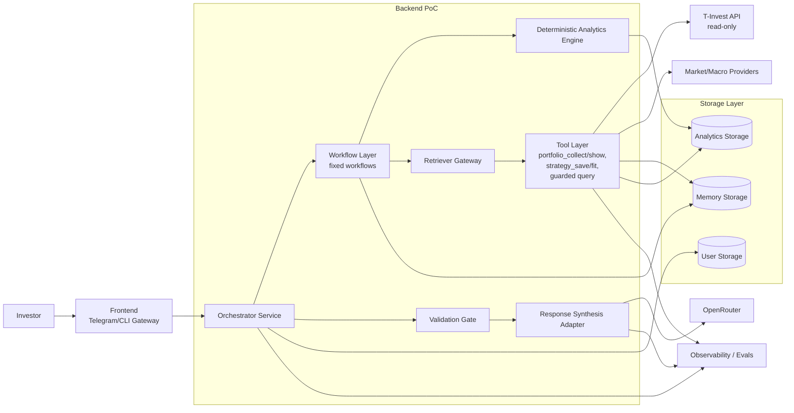

# C4 Container

Диаграмма разделяет ответственность контейнеров: workflow и аналитика принимают решения детерминированно, tool layer изолирует внешние источники, а LLM используется только на этапах классификации/синтеза через контролируемые адаптеры.
