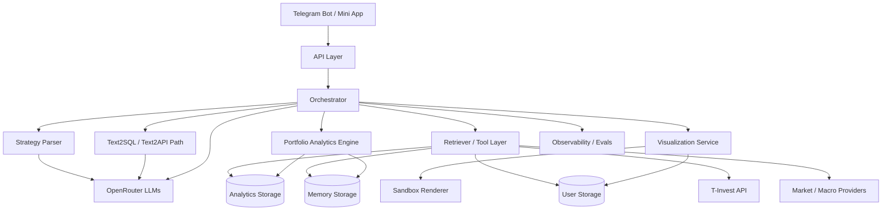

# C4 Container Diagram

```mermaid
flowchart TB
    ui[Telegram Bot / Mini App]
    api[API Layer]
    orch[Orchestrator]
    sp[Strategy Parser]
    pa[Portfolio Analytics Engine]
    tq[Text2SQL / Text2API Path]
    viz[Visualization Service]
    rt[Retriever / Tool Layer]
    userdb[(User Storage)]
    memdb[(Memory Storage)]
    adb[(Analytics Storage)]
    llm[OpenRouter LLMs]
    broker[T-Invest API]
    market[Market / Macro Providers]
    sandbox[Sandbox Renderer]
    obs[Observability / Evals]

    ui --> api
    api --> orch
    orch --> sp
    orch --> pa
    orch --> tq
    orch --> viz
    orch --> rt
    orch --> obs
    sp --> llm
    tq --> llm
    orch --> llm
    rt --> broker
    rt --> market
    rt --> userdb
    rt --> memdb
    rt --> adb
    pa --> adb
    pa --> memdb
    viz --> sandbox
    viz --> userdb
```

Оркестратор владеет request flow. Только ограниченные контейнеры имеют право вызывать LLM, а детерминированная аналитика остается вне генеративного контура.
