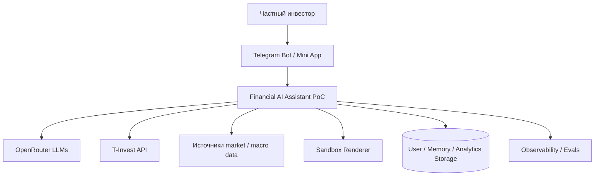

# C4 Context Diagram

Граница системы включает backend PoC, его оркестратор, хранилища и execution control logic. Внешние сервисы дают инференс, брокерские данные, рыночные данные и рендеринг, но ответственность за permissioning, validation, fallback и безопасный пользовательский вывод остается внутри системы.
