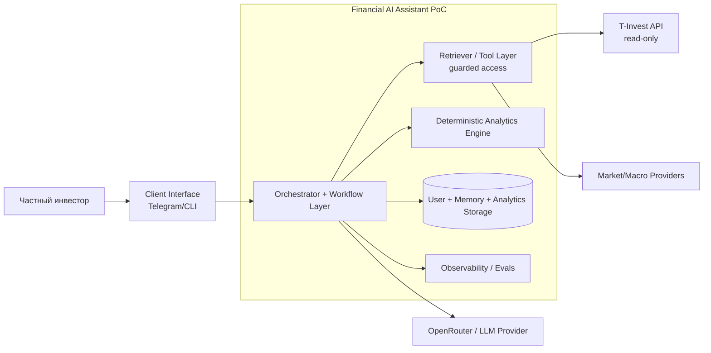

# C4 Context

Границы показывают ответственность: внутри PoC остаются роутинг, validation gate, fallback и user-scope контроль; снаружи только провайдеры данных/LLM без права менять внутренние политики доступа.
