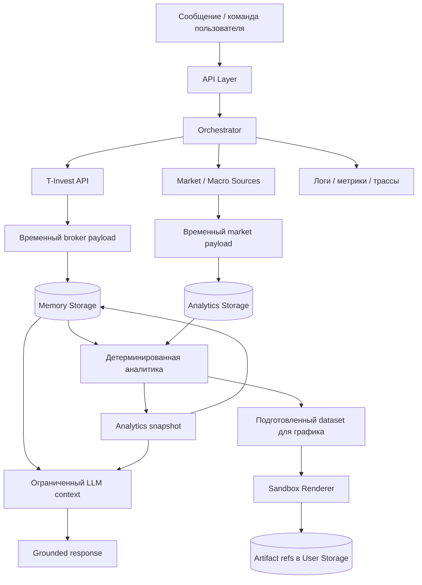

# Поток данных

Хранение минимизируется: сырые payloads по возможности остаются временными, snapshots живут по TTL, артефакты хранятся по ссылке, а логи содержат технические события вместо секретов и полных чувствительных payloads.
