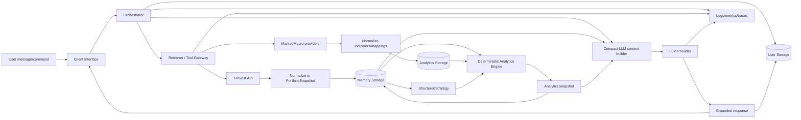

# Data Flow

Поток отделяет три класса данных: операционные (`session/request`), доменные (`StructuredStrategy`, snapshots, indicators) и наблюдаемость (`logs/traces`). В storage сохраняются нормализованные сущности с TTL/freshness, а в telemetry пишутся только технические события без секретов.
