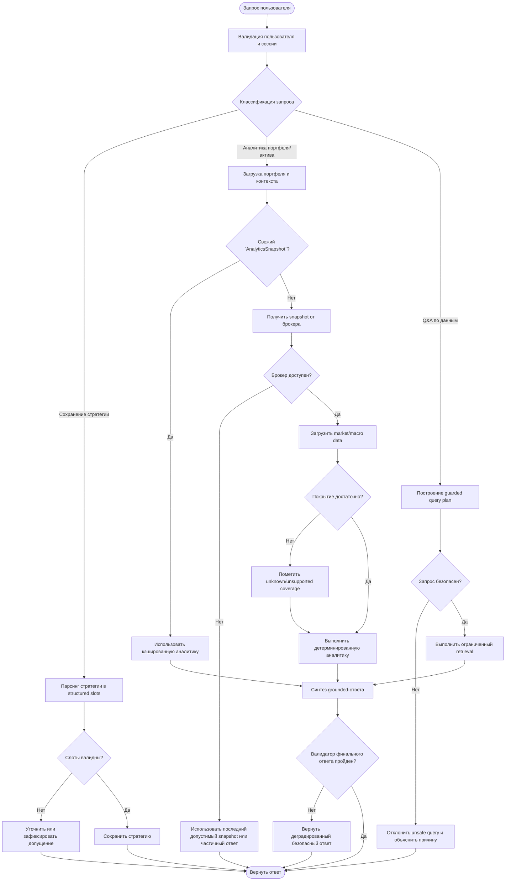

# Workflow запроса

```mermaid
flowchart TD
    start([Запрос пользователя]) --> auth[Валидация пользователя и сессии]
    auth --> classify{Классификация запроса}
    classify -->|Сохранение стратегии| parse[Парсинг стратегии в structured slots]
    classify -->|Аналитика портфеля/актива| load[Загрузка портфеля и контекста]
    classify -->|Q&A по данным| query[Построение guarded query plan]
    parse --> parseok{Слоты валидны?}
    parseok -->|Нет| clarify[Уточнить или зафиксировать допущение]
    parseok -->|Да| persist[Сохранить стратегию]
    load --> fresh{Свежий `AnalyticsSnapshot`?}
    fresh -->|Да| analyze[Использовать кэшированную аналитику]
    fresh -->|Нет| broker[Получить snapshot от брокера]
    broker --> brokerok{Брокер доступен?}
    brokerok -->|Нет| fallback1[Использовать последний допустимый snapshot или частичный ответ]
    brokerok -->|Да| enrich[Загрузить market/macro data]
    enrich --> enrichok{Покрытие достаточно?}
    enrichok -->|Нет| partial[Пометить unknown/unsupported coverage]
    enrichok -->|Да| compute[Выполнить детерминированную аналитику]
    partial --> compute
    analyze --> synth[Синтез grounded-ответа]
    compute --> synth
    query --> sqlok{Запрос безопасен?}
    sqlok -->|Нет| fallback2[Отклонить unsafe query и объяснить причину]
    sqlok -->|Да| executeq[Выполнить ограниченный retrieval]
    executeq --> synth
    synth --> validate{Валидатор финального ответа пройден?}
    validate -->|Нет| fallback3[Вернуть деградированный безопасный ответ]
    validate -->|Да| done([Вернуть ответ])
    clarify --> done
    persist --> done
    fallback1 --> done
    fallback2 --> done
    fallback3 --> done
```

Диаграмма показывает, где система может повторить шаг, где обязана деградировать в partial answer и где должна остановиться вместо unsupported generation.
